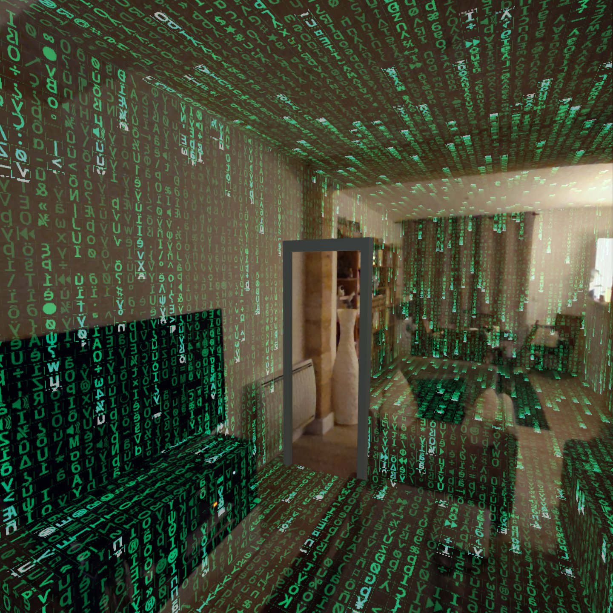

# Enter the Matrix - Quest 3

Sample code to test on Oculus Quest 3 w/ pass-through

## Requirements
* Unity 2022.3 LTS (Tested in with 2023.13.f1)
* Android Support for Unity
* Oculus Quest 3 

## Usage
* Set up a RoomScale limit to be able to freely move within your room
* Add some furnitures to improve the FX
* Look at a wall in front of you when launching the app : the portal will be automatically positionned in front of you at 90° of the closest wall

## Description
The project has been strip down to only focus on the two core features
* How to retrieve the playspace (using Oculus default Building Blocks) 
* How to render the Matrix FX : everything is done in the shader
*
## Limitations
* Only the view of the portal from inside the portal is present. 
* No switch from inside/outside view (check the app below)

## References
* LinkedIn original post : https://www.linkedin.com/posts/oliviergoguel_meta-quest3-oculus-activity-7152998913229156352-v0X8?utm_source=share&utm_medium=member_desktop
* SideQuestVR app : https://sidequestvr.com/app/28790/enter-the-matrix-experiment
* Youtube : https://youtu.be/t52UfLy00i8

## Licence
* MIT License

## History
* v1.0 January 13, 2024th
	* Initial Release
